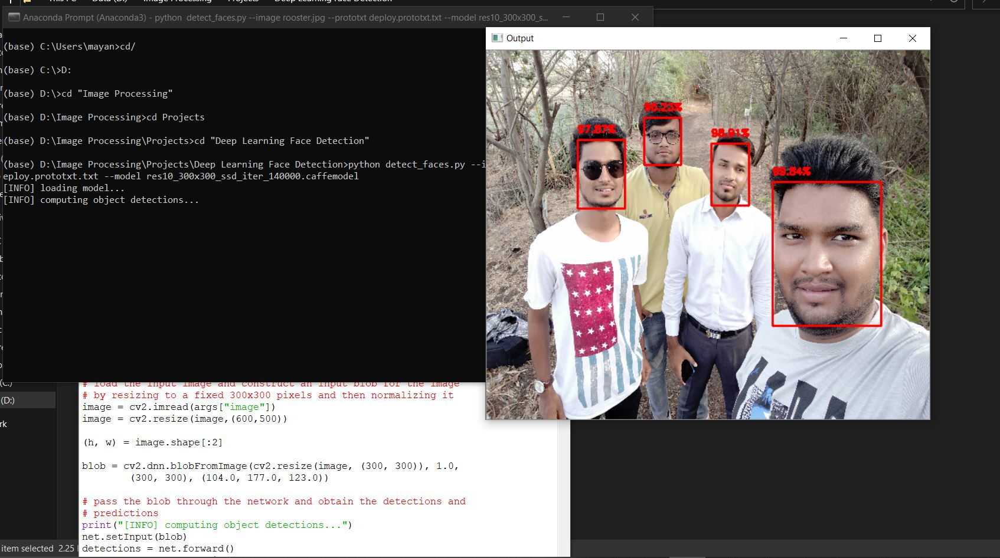

# Deep-Learning-Face-Detection
Detect your face in any image using openCV with dnn module 
Today I’m going to share a little known secret with you regarding the OpenCV library:

You can perform fast, accurate face detection with OpenCV using a pre-trained deep learning face detector model shipped with the library.

You may already know that OpenCV ships out-of-the-box with pre-trained Haar cascades that can be used for face detection…

…but I’m willing to bet that you don’t know about the “hidden” deep learning-based face detector that has been part of OpenCV since OpenCV 3.3.

# Run File by following command
python detect_faces.py --image rooster.jpg --prototxt deploy.prototxt.txt --model res10_300x300_ssd_iter_140000.caffemodel

# Topics Covered

Where this “hidden” deep learning face detector lives in the OpenCV library
How you can perform face detection in images using OpenCV and deep learning
How you can perform face detection in video using OpenCV and deep learning
As we’ll see, it’s easy to swap out Haar cascades for their more accurate deep learning face detector counterparts.

# When using OpenCV’s deep neural network module with Caffe models, you’ll need two sets of files:

The .prototxt file(s) which define the model architecture (i.e., the layers themselves)
The .caffemodel file which contains the weights for the actual layers
Both files are required when using models trained using Caffe for deep learning.

However, you’ll only find the prototxt files here in the GitHub repo.

The weight files are not included in the OpenCVsamples  directory and it requires a bit more digging to find them…

A Glimpse of Output 

  

# Query?
Contact me - mayankbajaj114@gmail.com
